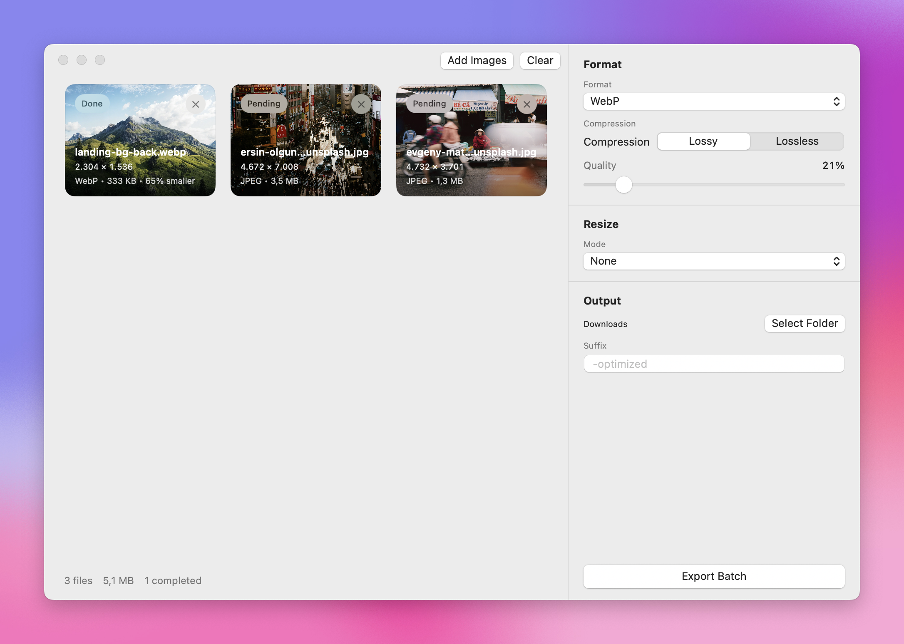

# MacSqueeze

MacSqueeze is a native macOS app for batch image compression, conversion, and resizing. Drop in a folder of images, pick one export recipe, and ship the whole batch in one pass.



## Features

- Native SwiftUI app for macOS
- Drag-and-drop import for files and folders
- Batch export to `JPEG`, `PNG`, `HEIC`, and `WebP`
- Lossy and lossless export modes where supported
- Resize by width, height, longest edge, or percentage
- Per-image status and size reduction feedback during export
- Custom export folder and filename suffix

## Download

Prebuilt DMGs are attached to every release on [GitHub Releases](https://github.com/lauridskern/macsqueeze/releases).

## Development

```bash
swift build
swift run MacSqueeze
```

## Test

```bash
swift test
```

## Releasing

MacSqueeze ships from GitHub Actions.

1. Work on `dev`.
2. Open a PR from `dev` into `main`.
3. Merge into `main` only when you want to ship a release.
4. The `Release` workflow runs tests, builds the `.app`, packages a `.dmg`, bumps the next patch version, creates a new `v*` tag, and publishes the GitHub release automatically.

The default versioning flow is automatic patch bumps: `v0.1.0`, `v0.1.1`, `v0.1.2`, and so on.

## Project Layout

- `Sources/` contains the SwiftUI app and image-processing code
- `Tests/` contains the package test suite
- `scripts/` contains the local packaging scripts used by CI and releases
- `.github/workflows/` contains CI and release automation

## License

MIT. See [LICENSE](LICENSE).
